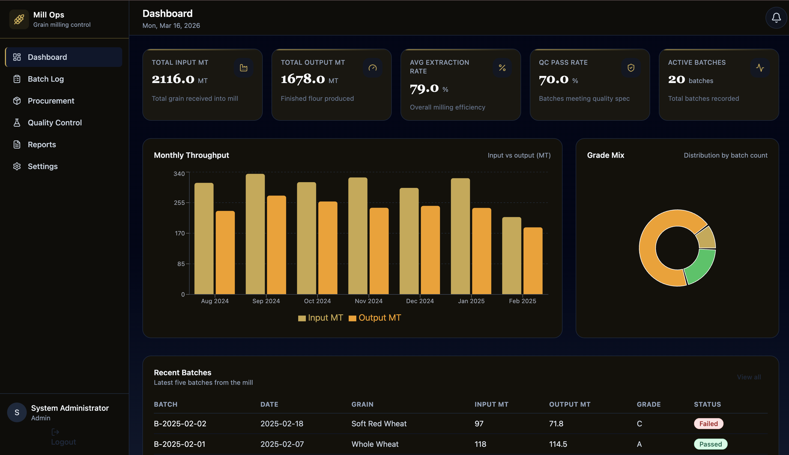
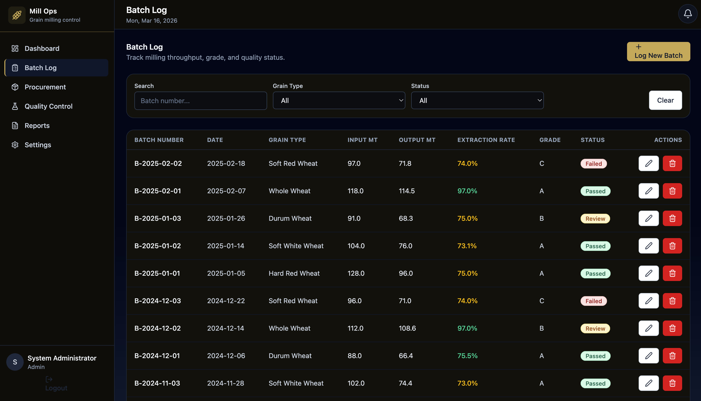
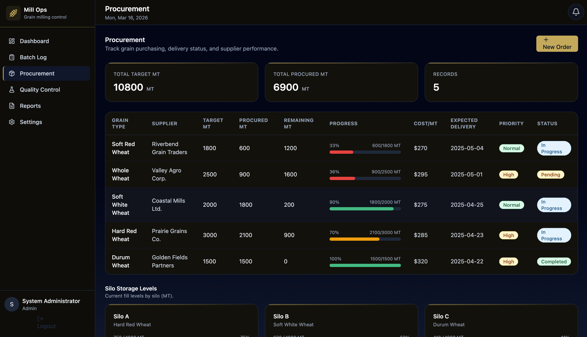
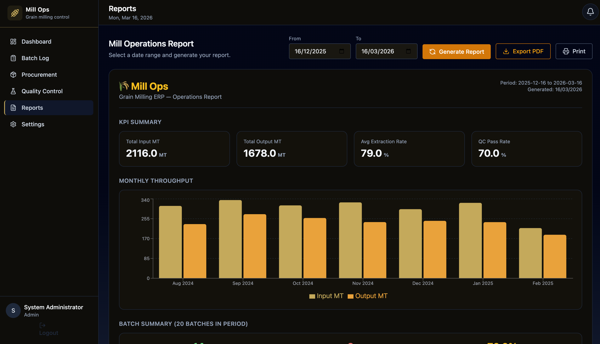

# 🌾 Grain Milling ERP

**A full-stack ERP for grain milling operations: batch tracking, procurement, silo inventory, quality control, and reporting.**

---

## 🚀 Live Demo

| | |
|---|---|
| **Demo** | [Live Demo](https://milling-erp.vercel.app) |
| **Email** | `admin@millops.com` |
| **Password** | `admin123` |

---

## ✨ Features

| Module | Description |
|--------|-------------|
| 📊 **Dashboard** | KPIs, monthly trends, recent batches, and quick insights |
| 📦 **Batches** | Create, edit, and track milling batches (input/output, extraction rate, quality params) |
| 🚚 **Procurement** | Manage grain orders, suppliers, targets, and delivery tracking |
| 🏭 **Silos** | Monitor silo capacity, current levels, and grain types |
| 🔬 **Quality Control** | Batch QC status, quality tests, and pass/fail workflow |
| 📄 **Reports** | Operations report with date range, export to PDF, print view |
| ⚙️ **Settings** | User preferences and default targets |
| 🔐 **Auth** | Login with JWT; protected routes and role-aware UI |

---

## 🛠 Tech Stack

| Layer | Technologies |
|-------|--------------|
| **Frontend** | React 18, Vite, Tailwind CSS, Recharts, React Router v6, Axios |
| **Backend** | Node.js, Express, better-sqlite3, JWT, bcryptjs |
| **Tools** | Cursor AI, Git/GitHub, Thunder Client |

---

## 🏗 Architecture

The app uses a **3-layer architecture**:

1. **Presentation (client)** — React SPA with Vite. Handles UI, client-side routing, and API calls via Axios. Auth state is managed with React Context.
2. **Application (server)** — Express REST API. Validates requests, applies business logic, and returns JSON. JWT middleware protects sensitive routes.
3. **Data (SQLite)** — better-sqlite3 for persistence. Single file DB with WAL and foreign keys; no separate DB process.

This split keeps the frontend focused on UX, the backend on rules and security, and the data layer easy to swap (e.g. SQLite → PostgreSQL) without changing client or API design.

---

## 📐 Database Schema

Main tables:

| Table | Purpose |
|-------|---------|
| **batches** | Milling runs: `batch_number`, `date`, `grain_type`, `input_mt`, `output_mt`, `extraction_rate`, `ash_content`, `moisture_pct`, `protein_pct`, `grade`, `status`, `operator_name`, `notes` |
| **procurement** | Grain orders: `grain_type`, `supplier_name`, `target_mt`, `procured_mt`, `cost_per_mt`, `lead_time_days`, `order_date`, `expected_delivery`, `priority`, `status`, `quarter` |
| **silos** | Storage: `silo_name`, `capacity_mt`, `current_mt`, `grain_type`, `last_updated` |
| **quality_tests** | QC results: `batch_id`, `test_date`, `tester_name`, `ash_result`, `moisture_result`, `protein_result`, `passed` |
| **users** | Auth: `name`, `email`, `password_hash`, `role`, `created_at` |

Relations: `quality_tests.batch_id` → `batches.id`. All tables use integer primary keys and timestamps where relevant.

---

## 📋 Getting Started

### Prerequisites

- **Node.js** 18+ and **npm**

### 1. Clone the repository

```bash
git clone https://github.com/JahnaviBonu/milling-erp.git
cd milling-erp
```

### 2. Backend setup

```bash
cd server
npm install
npm start
```

API runs at **http://localhost:3001**.

### 3. Seed sample data (optional)

In the same `server` directory:

```bash
npm run seed
```

### 4. Frontend setup

In a new terminal:

```bash
cd client
npm install
npm run dev
```

App runs at **http://localhost:5173**.

### 5. Log in

Use **admin@millops.com** / **admin123** (or other seeded users) to access the app.

---

## 🔑 Key Technical Decisions

| Decision | Rationale |
|----------|-----------|
| **Vite over CRA** | Faster dev server and builds, native ESM, simpler config. CRA is in maintenance mode; Vite is the recommended default for new React apps. |
| **SQLite for development** | Zero setup, single file, easy to seed and reset. Fits single-mill, single-user or small-team demos and keeps the repo self-contained. |
| **JWT for auth** | Stateless auth; no server-side session store. Works well with REST and scales to multiple instances. Token stored in memory/localStorage and sent via header. |
| **Context API over Redux** | Auth and app-wide state are limited; Context is enough and avoids Redux boilerplate. Easier to reason about for a portfolio-sized app. |
| **Optimistic UI updates** | List and form updates reflect immediately before the server responds, then reconcile on success or roll back on error. Improves perceived performance and responsiveness. |

---

## 📸 Screenshots

| Dashboard | Batches | Procurement | Reports |
|-----------|---------|-------------|---------|
|  |  |  |  |

---

## 🔮 Future Improvements

- **PostgreSQL for production** — Migrate from SQLite for concurrent writes, backups, and production-grade reliability.
- **n8n automations** — Workflow triggers (e.g. low silo level → procurement alert, batch passed → notify QA).
- **Mobile app** — React Native or PWA for operators on the floor (batch logging, quick QC).
- **Multi-mill support** — Tenancy by mill ID, role-based access per site, and consolidated group reporting.

---

*Grain Milling ERP — portfolio project by [Jahnavi Bonu](https://github.com/JahnaviBonu).*
